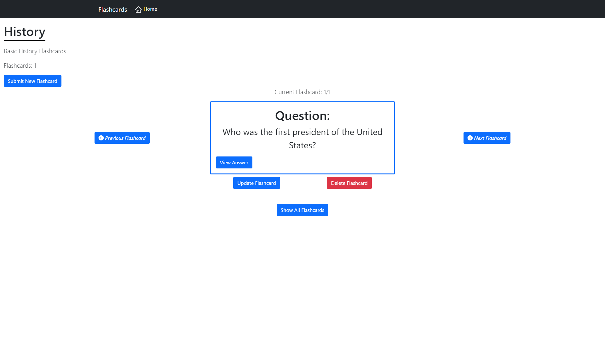
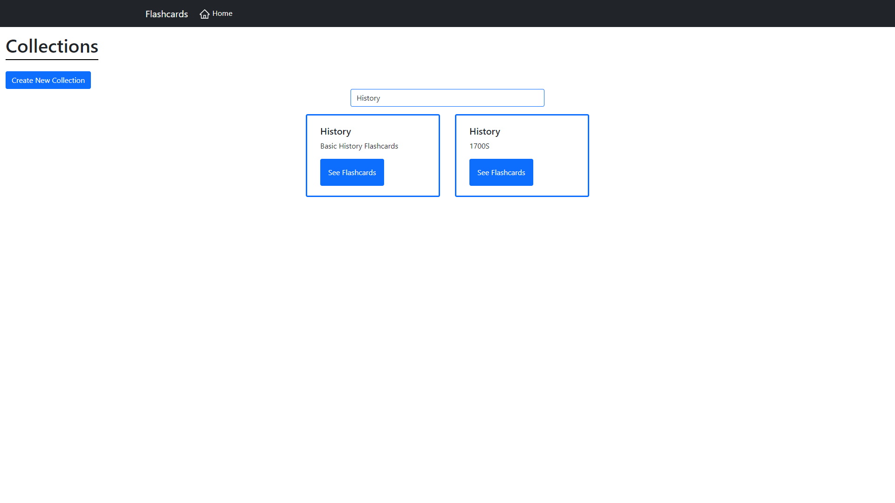

# Flashcard Tracker

Flashcard Tracker was created for users looking to keep track of collections of flashcards and also search through collections of flashcards.

## Table of Contents
- [Project Status](#project-status)
   - [Goals](#goals)
   - [Task List](#task-list)
   - [Future Tasks](#future-tasks)
- [Technologies](#technologies)
- [Bugs](#bugs)
- [Images](#Images)

---
## Project Status :green_circle:
### Goals
- Enable a user to be able to create a new collection of flashcards
- Enable a user to view the collection of flashcards with description and collection length
- Enable a user to search for a specific collection of flashcards
- Enable a user to be able to see all flashcards
- Enable a user to be able to see the current flashcard being displayed

### Task List: 

:heavy_check_mark: Enable a user to be able to create a new collection of flashcards

:heavy_check_mark: Enable a user to update a flashcard

:heavy_check_mark: Enable a user to delete a flashcard

:heavy_check_mark: Enable a user to view the collection of flashcards with description and collection length

:heavy_check_mark: Enable a user to search for a specific collection of flashcards

:heavy_check_mark: Enable a user to be able to see all flashcards

:heavy_check_mark: Enable a user to be able to see the current flashcard being displayed

<!--- 
Emojis for the Task List:
DONE =      :heavy_check_mark:
NOT DONE =  :x:
WIP =       :recycle:
BUGGED =    :warning:
 --->

### Future Tasks  
:x: Add ability to change between light and dark mode 

:x: Add ability to be able to be able to update a collection
:x: Add login and signup functionality 
:x: Add functionality for donations

---
## Technologies
- Visual Studio Code
- Django 
- React
- Django Rest API
- Framer Motion API
- React Card Flip API
- Bootstrap
- React Bootstrap
- Git / GitHub

## Knowledge Used
- CSS
- Bootstrap
- React
- Django
- Framer Motion API

---
## Design
### Collection Home
- Implemented a form for creating a new collection
- Implemented a search bar for searching for a collection
- Implemented a fade in animation using Framer Motion API
- Implemented a card to display all collections with collection title and description
### Flashcard Home
- Implemented a modal for creating a new flashcard
- Implemented a modal for updating a flashcard
- Implemented a modal for deleting a flashcard
- Implemented a counter for total flashcards and the current flashcard
- Implemented a button for showing all flashcards with a stagger animation using Framer Motion API
### Flashcard Display
- Implemented a display for a flashcard question and flashcard answer
- Implemented functionality for flipping a card over to view the question or answer

---
## Images

---

